# 📱 CheapDeal Mobile App

A mobile application built for modern Android operating systems (e.g., Android 10+) to allow users to browse and purchase mobile and broadband packages. The app also improves communication between customers and Customer Service Representatives (CSRs).

---

## 🧾 Description
This mobile app is designed to:
- Sell package combinations (mobile devices + broadband options)
- Facilitate customer account management
- Enhance CSR support and interaction

## 🚀 Features
### 👤 Customer Management & Interaction
- User login and registration
- Profile creation and editing
- Submit enquiries
- Change password
- Configure payment method and credit card number

### 📦 Package Browsing & Order Processing
- Browse default and custom packages
- View and select bundle deals (e.g., DoublePackage, TriplePackage)
- Place orders via the app
- Auto-calculate totals with applicable discounts or offer codes

### 🧑‍💼 CRM & Sales Support
- CSR access to customer profiles and package data
- Caller verification support
- Respond to customer enquiries
- Process payments
- Profile customers and send targeted special offers via app

## 📦 Installation
### 1. Install XAMPP  
👉 [Download XAMPP](https://www.apachefriends.org/download.html)

### 2. Clone the GitHub Repository
```bash
# Go to htdocs directory of XAMPP
cd /path-to-xampp/htdocs

# Clone this repository
git clone https://github.com/MinhDucabc/CheapDealAppScrum.git
```

### 3. Start MySQL Server

Open **XAMPP**, then:

- Click **Start** on the **MySQL** module  
  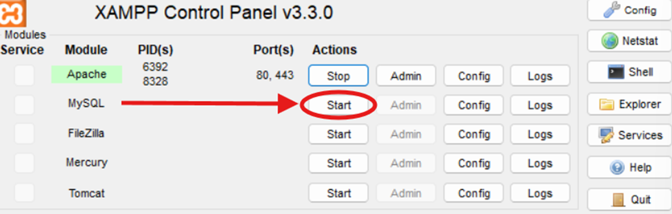


- Click **Admin** to open the database interface  
  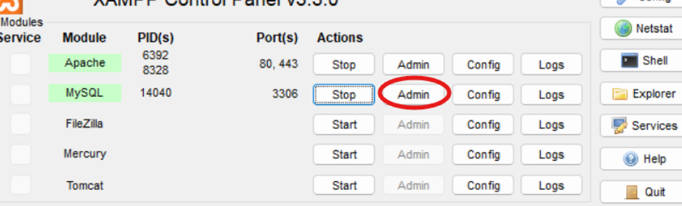

- Once in DataBase Interface, Click on **Import** and choose the **cheapdeals_scrum.sql** file to load the whole database
  
  

---

### 4. Start Apache Server

- In **XAMPP**, click **Start** on the **Apache** module
- 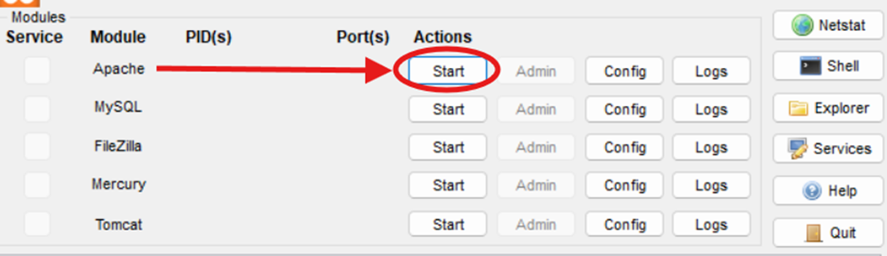

- Click **Admin** to launch the browser and preview the project by accessing the cloned `CheapDealAppScrum` folder  
- 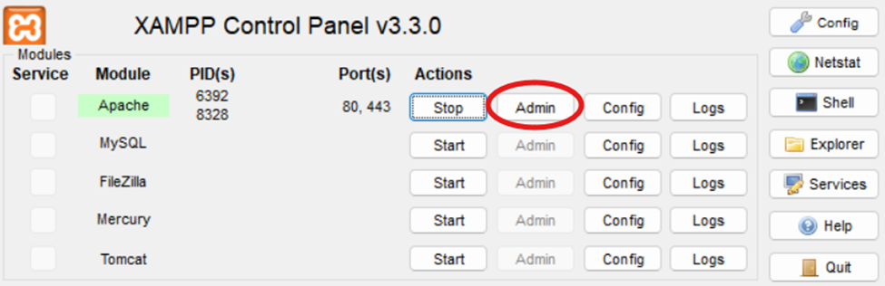

---

## ❓ FAQ

**Q: Why does the browser show `Undefined variable $pdo in C:...`?**  
**A:** You must start the **MySQL Server** in XAMPP **before** loading the application in the browser to ensure database connectivity.

  
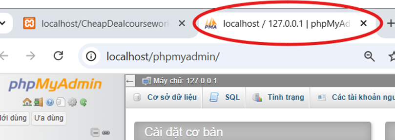

---

## 💻 Technology Stack

- **Frontend:** HTML, CSS, JavaScript, TailwindCSS  
- **Backend:** PHP  
- **Database:** MySQL  
- **Collaboration Tool:** Git  

---

## 🖼️ Screenshots

### 🔐 Login & Signup Pages
- **Login Page:** Allows registered users to sign into their accounts.  
  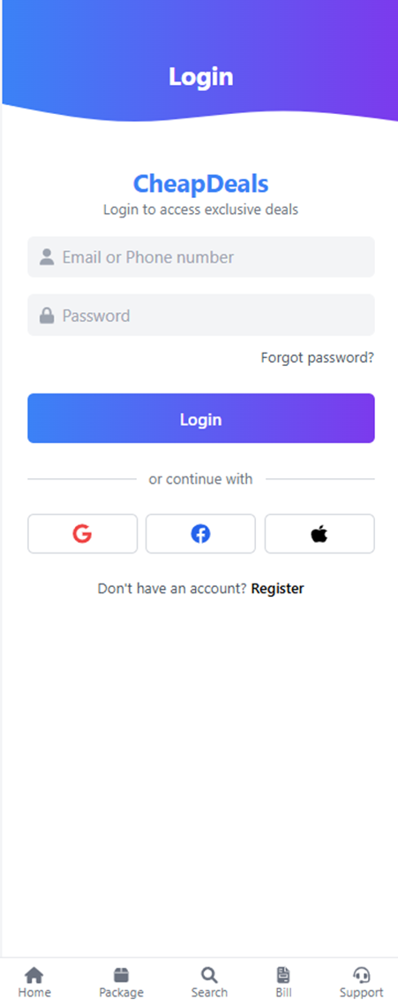

- **Sign Up Page:** New users can register by providing their personal and payment information.  
  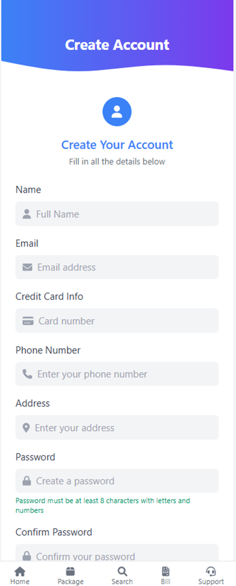

---

### 👤 Profile Page
- View and edit user details such as name, email, address, and credit card info.  
  

---

### 🏠 Homepage
- Dashboard view displaying available packages, deals, and quick navigation.  
  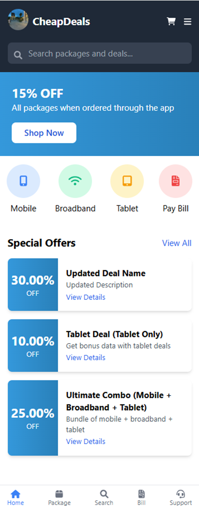
- Additional view showcasing dynamic content or featured promotions.  
  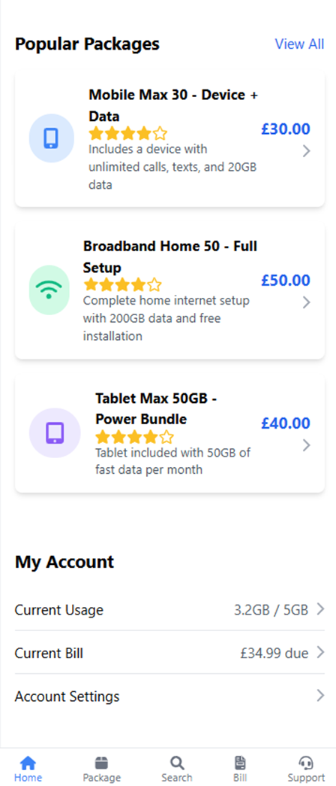

---

### 📦 Package Pages
- Browse all available packages: MobileOnly, TabletOnly, BroadbandOnly, and custom deals.  
  
- Additional layout for package selection or filtering options.  
  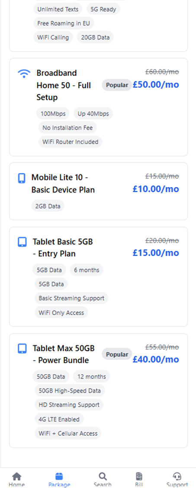

---

### 📦 Package Detail / 💼 Deal Detail
- Detailed view of a selected package, showing included features and pricing.  
  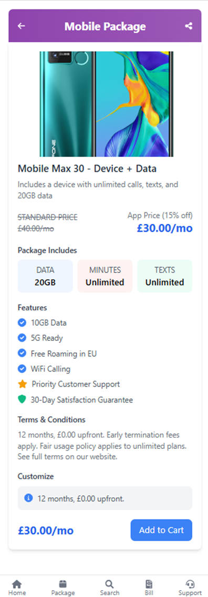

- Detailed view of a selected deal, including bunch of specific packages with discount.  
  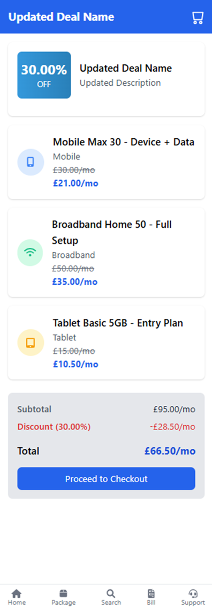

---

### 🛒 Cart & Checkout
- Cart displays selected packages, quantities, and running total.  
  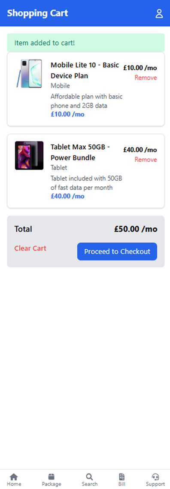

- Final checkout screen for order review and credit card payment.  
  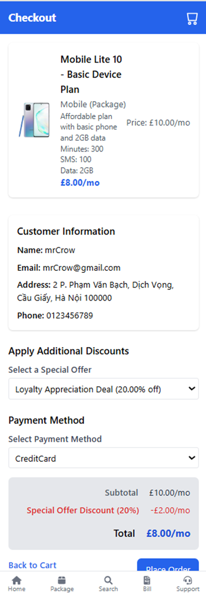

---

### 🗂️ Database Design
- ERD (Entity Relationship Diagram) showing how customer, package, order, CSR data and much more are related in the system.  
  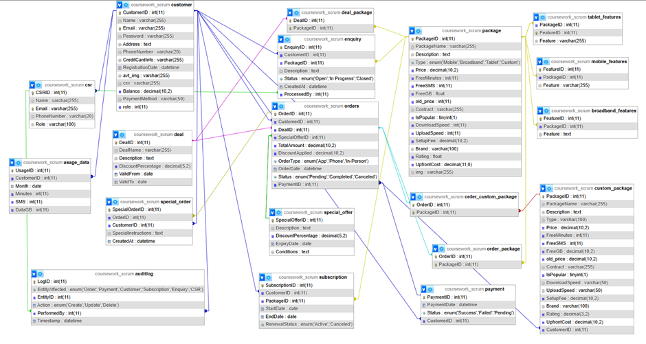

