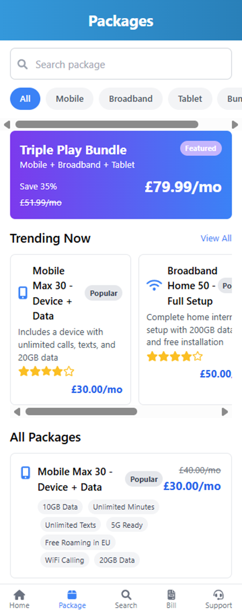

# 📱 CheapDeal Mobile App

A mobile application built for modern Android operating systems (e.g., Android 10+) to allow users to browse and purchase mobile and broadband packages. The app also improves communication between customers and Customer Service Representatives (CSRs).

---

## 🧾 Description
This mobile app is designed to:
- Sell package combinations (mobile devices + broadband options)
- Facilitate customer account management
- Enhance CSR support and interaction

## 🚀 Features
### 👤 Customer Management & Interaction
- User login and registration
- Profile creation and editing
- Submit enquiries
- Change password
- Configure payment method and credit card number

### 📦 Package Browsing & Order Processing
- Browse default and custom packages
- View and select bundle deals (e.g., DoublePackage, TriplePackage)
- Place orders via the app
- Auto-calculate totals with applicable discounts or offer codes

### 🧑‍💼 CRM & Sales Support
- CSR access to customer profiles and package data
- Caller verification support
- Respond to customer enquiries
- Process payments
- Profile customers and send targeted special offers via app

## 📦 Installation
### 1. Install XAMPP  
👉 [Download XAMPP](https://www.apachefriends.org/download.html)

### 2. Clone the GitHub Repository
```bash
# Go to htdocs directory of XAMPP
cd /path-to-xampp/htdocs

# Clone this repository
git clone https://github.com/MinhDucabc/CheapDealAppScrum.git
```

### 3. Start MySQL Server

Open **XAMPP**, then:

- Click **Start** on the **MySQL** module  
  


- Click **Admin** to open the database interface  
  


---

### 4. Start Apache Server

- In **XAMPP**, click **Start** on the **Apache** module
- 

- Click **Admin** to launch the browser and preview the project by accessing the cloned `CheapDealAppScrum` folder  
- 

---

## ❓ FAQ

**Q: Why does the browser show `Undefined variable $pdo in C:...`?**  
**A:** You must start the **MySQL Server** in XAMPP **before** loading the application in the browser to ensure database connectivity.

  


---

## 💻 Technology Stack

- **Frontend:** HTML, CSS, JavaScript, TailwindCSS  
- **Backend:** PHP  
- **Database:** MySQL  
- **Collaboration Tool:** Git  

---

## 🖼️ Screenshots

### 🔐 Login & Signup Pages


### 👤 Profile Page


### 🏠 Homepage


### 📦 Package Pages
  
  


### 📦 Package Detail / 💼 Deal Detail


### 🛒 Cart & Checkout
  


### 🗂️ Database Design

